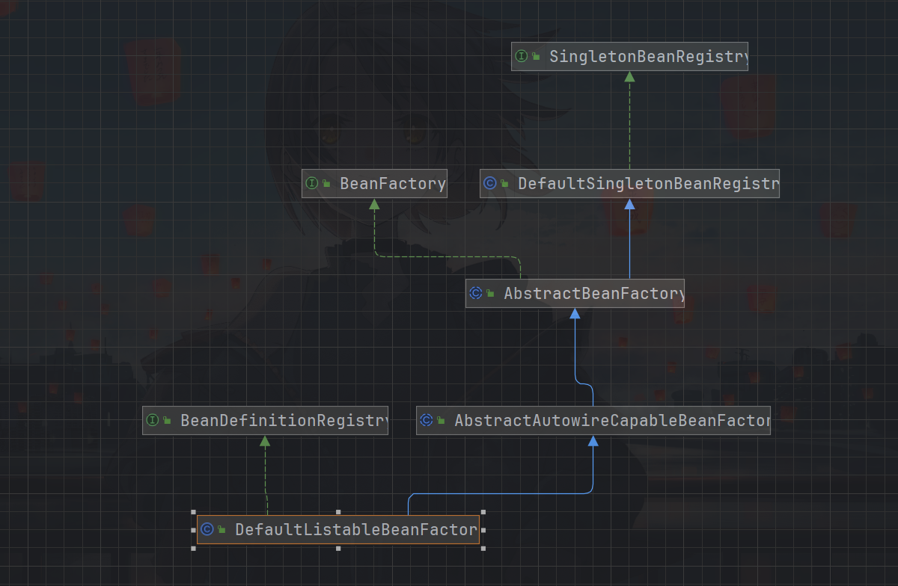
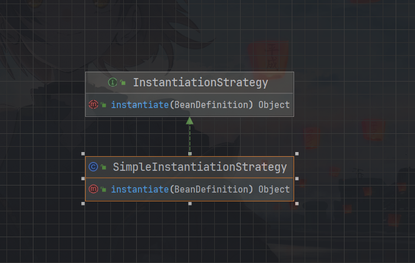
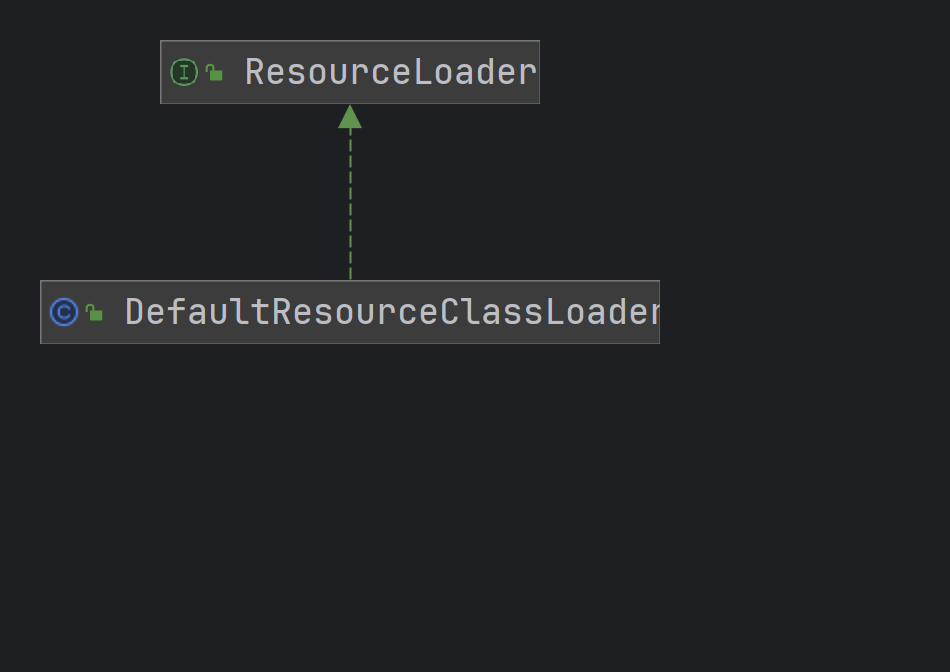
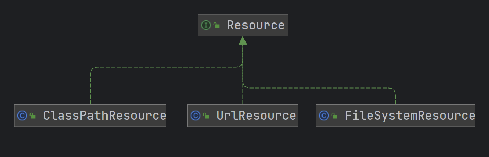
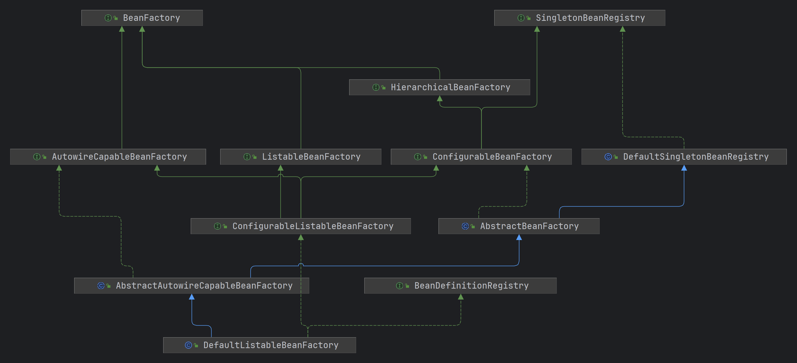
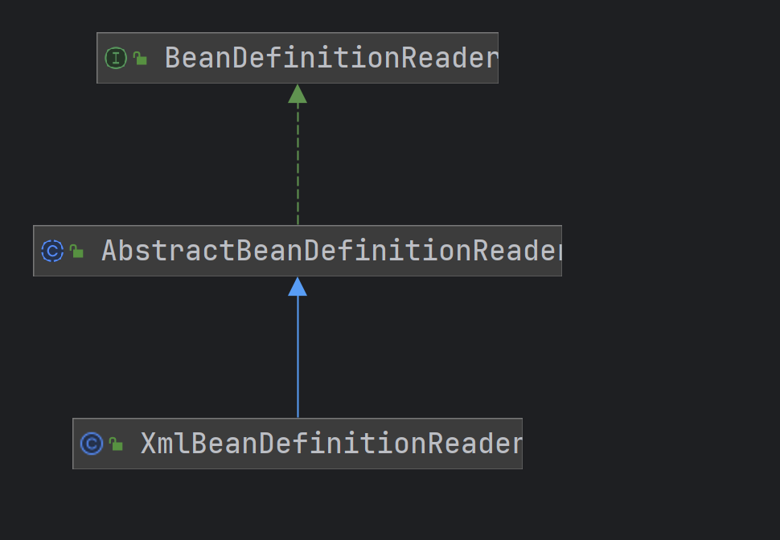
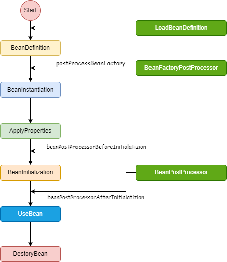
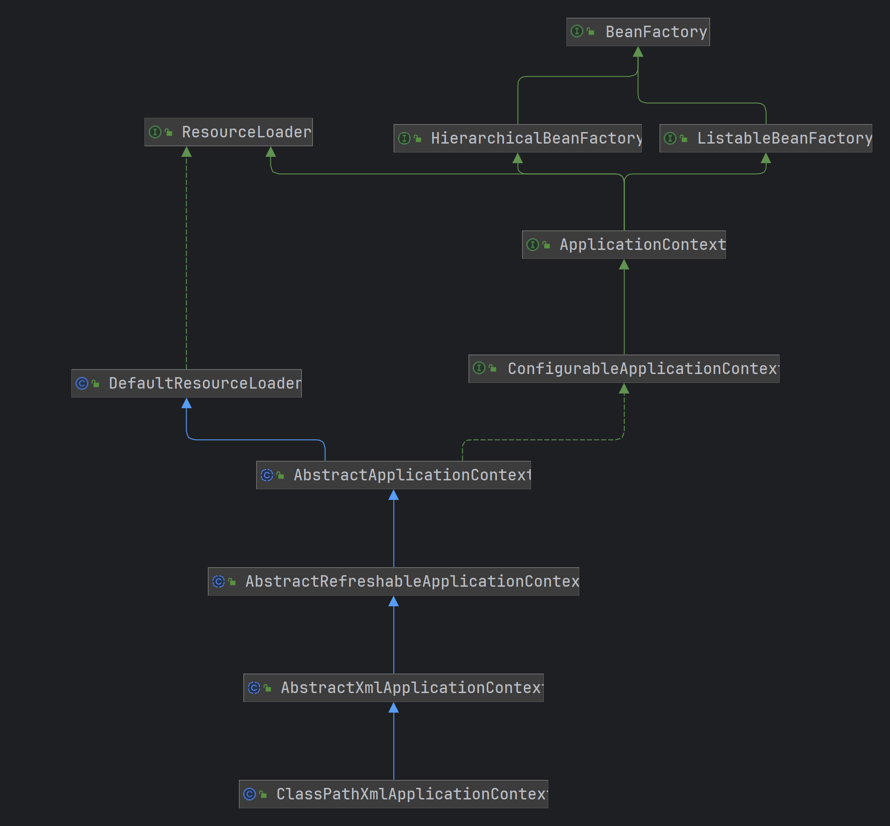
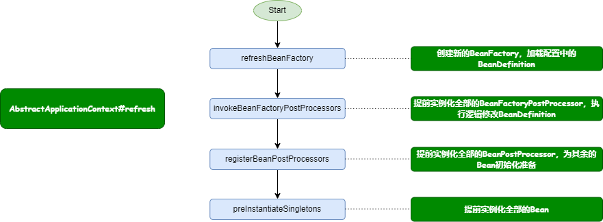
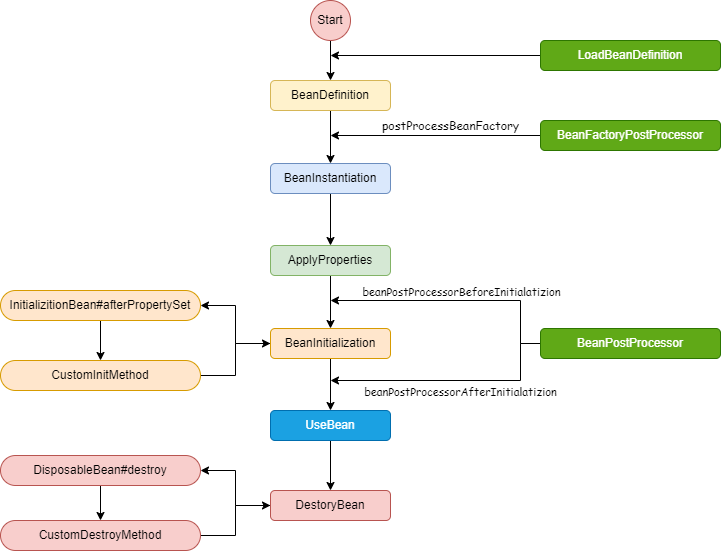

# Simple-Bean-Factory

创建一个简单的`BeanFactory`

# Bean Definition Registry and Bean Factory

`Bean Definition` 和 `Bean Singleton`注册

- `BeanDefinition` 保存bean的基本信息，这里简化为保存bean的class类型，用于反射构建类实例
- `BeanDefinitionRegistry` 提供注册BeanDefinition的注册接口
- `SingletonBeanRegistry` 提供Bean对象的单例接口
- `DefaultSingletonBeanRegistry` 实现`SingletonBeanRegistry`接口，提供单例map，获取单例Bean的时候Lazy创建单例对象
- `AbstractAutowireCapableBeanFactory` `AbstractBeanFactory`抽象类接口，提供lazy创建单例的具体实现
- `DefaultListableBeanFactory` 实现详细的Bean注册和获取流程

# Populate Bean with Property

Populate bean with property values,using simple instantiation strategy

- 更新`BeanDefinition`，添加`PropertyValues`属性，用于填充Bean对象的成员属性
- 实现简单Bean填充策略`SimpleInstantiationStrategy`
- Bean初始化流程---使用默认构造方法创建Bean实例---使用默认Simple填充策略给Bean对象填充`PropertyValues`中的全部属性

# Populate Bean with Bean

- 新增Bean引用关系对象`BeanReference`，用于在Properties中说明Bean之间的引用关系
- 修改Bean的属性注入方法，如果是引用BeanB，则会关联创建BeanB的对象然后属性注入到BeanA中
- 暂时不支持循环依赖

# Resource and ResourceLoader

- 新增Resource接口以及Resource的实现类`ClassPathResource`、`FileSystemResource`、`UrlResource`
- 新增ResourceLoader接口以及默认实现类`DefaultResourceClassLoader`，按照类路径，文件和url的方式进行

# Xml Bean Definition

使用xml格式进行Bean对象的声明和属性注入，对于BeanFactory进行进一步的抽象，具体参考继承图

- 将`BeanFactory`系列的接口和抽象类进行进一步的抽象处理，抽象层次参考继承图，会在后面具体描述每一个接口的作用
- 实现类Spring形式的xml文件定义Bean和进行Bean的属性注入，使用xml格式支持对Bean的String属性和bean属性进行注入，目前不支持对于其他基本数据格式的注入
- `BeanDefinitionReader`是读取Bean信息的抽象接口，其中包含两个属性分别是`BeanDefinitionRegistry`是Bean定义信息的注册中心和`ResourceLoader`是定义文件的加载器。
- `BeanDefinitionReader`中的`loadBeanDefinition`是重要方法，用于从资源文件中解析Bean定义

# BeanFactoryPostProcessorAndBeanPostProcessor

`BeanFactoryPostProcessor`接口实现了对BeanDefinition进行修改，允许我们在Bean对象实例化之前修改BeanDefinition中的属性信息
而`BeanPostProcessor`接口在Bean实例化和属性填充之后，在Bean的初始化阶段之前执行`postProcessBeforeInitialization`方法，在初始化阶段执行之后执行`postProcessBeforeInitialization`。
`BeanPostProcessor`允许在Bean实例化之后修改Bean对象或者替换Bean对象

- `创建BeanFactoryPostProcessor`，其实现类`postProcessBeanFactory`通过修改`ConfigurableListableBeanFactory`中的`BeanDefinitionMap`来修改`BeanDefinition`
- 创建`BeanPostProcessor`接口，修改getBean方法的实现逻辑，在实例化Bean之后围绕Bean初始化阶段来增强Bean

# ApplicationContext

`ApplicationContext`是在BeanFactory基础之上的进一步封装，支持BeanFactory的全部功能，在此基础之上，新增对`BeanFactoryPostProcessor`和`BeanPostProcessor`的自动识别、
bean声明配置的资源加载，后续还会扩充关于容器事件和监听器、单例bean的自动初始化等
BeanFactory是spring的基础设置，而Application是对BeanFactory的封装，面向Spring的使用者

- 创建`ApplicationContext`接口以及其系列实现类，具体实现流程可参考上面的继承关系。
- `ApplicationContext`中的重要方法`refresh`用于重建`BeanFactory`并自动加载`BeanDefinition`，提前初始化全部Bean对象，具体的方法逻辑可以参考上图
- 重构包名

# Init-and-Destroy-Method

在Spring中，Bean在初始化阶段和销毁阶段可以执行不同的方法，具体可以通过以下方式来进行定义
1. 在配置文件（xml）中定义`init-method`和`destroy-method`
2. 类定义中分别继承InitializingBean和DisposableBean，其中的afterPropertySet方法和destroy分别在初始化阶段和销毁阶段进行执行
3. 通过在类定义方法中添加`@PostConstruct`和`@PreDestroy`注解

上述三种不同的实现方式，在本小节中实现了前两种。
- 为了实现自定义初始化方法和自定义销毁方法，重构了`BeanDefinition`的成员属性和加载xml的过程，使其能够加载自定义初始化和销毁方法
- 初始化方法在`AbstractAutowireCapableBeanFactory#invokeInitMethods`执行。
- 创建适配器类`DisposableBeanAdapter`，用于将实现自定义实现的销毁方法进行封装
，拥有销毁方法的bean在`AbstractAutowireCapableBeanFactory#registerDisposableBeanIfNecessary`中注册到`disposableBeans`中。
- 为了确保销毁方法在虚拟机关闭之前执行，向虚拟机中注册一个钩子方法，查看`AbstractApplicationContext#registerShutdownHook`（非web应用需要手动调用该方法）。
- 当然也可以手动调用`ConfigurableApplicationContext#close`方法关闭容器。